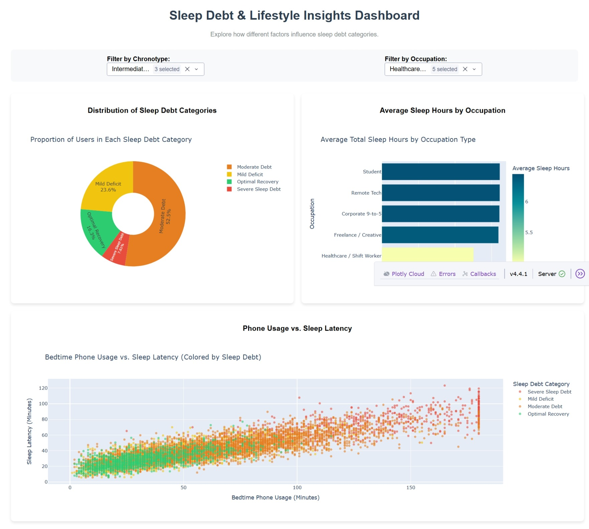
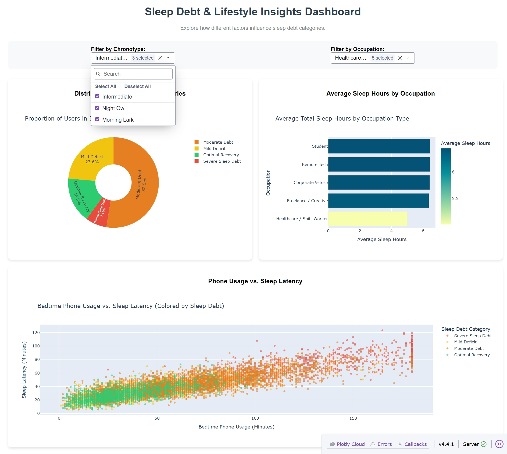
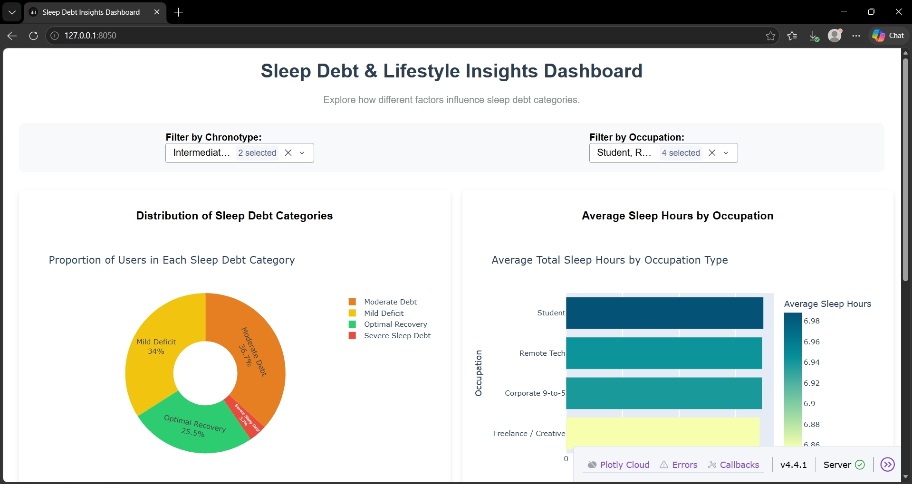

```markdown
# DTEN Sleep Project: Data Science & Analytics Internship

## 📖 Project Overview
This repository contains the completed tasks for the **Daryl Tech & Educational Network (DTEN)** Data Science & Analytics Internship. 

The project focuses on analyzing a dataset of **8,500 users** to understand the factors contributing to **Sleep Debt**. By leveraging Exploratory Data Analysis (EDA), Predictive Modeling, and Interactive Dashboards, this project uncovers insights into how lifestyle, occupation, and bedtime habits impact sleep quality.

## 📂 Repository Structure
```text
DTEN_Sleep_Project/
│
├── Task1_EDA/                  # Task 1: Exploratory Data Analysis
│   ├── charts/                 # Saved visualizations (PNGs)
│   ├── eda_analysis.ipynb      # Jupyter Notebook with EDA code
│   ├── sleep_cleaned.csv       # Cleaned dataset used for all tasks
│   └── sleep.csv               # Raw initial dataset
│
├── Task2_EDA/                  # Task 2: Predictive Model Building
│   ├── feature_importance.png  # Visualization of model feature importances
│   ├── model_report.md         # Detailed evaluation metrics and insights
│   ├── model.ipynb             # Jupyter Notebook with model training code
│   └── sleep_debt_model.pkl    # Trained RandomForestClassifier model
│
├── Task3_Dashboard/            # Task 3: Interactive Insights Dashboard
│   └── dashboard.py            # Plotly Dash interactive dashboard code
│
├── venv/                       # Virtual environment
├── README.md                   # Project documentation (this file)
└── requirements.txt            # Python dependencies
```

---

## 🛠️ Task 1: Exploratory Data Analysis (EDA)

**Objective:** Clean the raw dataset and uncover trends, patterns, and anomalies related to sleep debt.

### Key Steps Taken:
- **Data Cleaning:** Handled missing values, encoded categorical variables (e.g., `sleep_debt_encoded`), and mapped labels.
- **Analysis:** Used `Pandas` for statistical summaries and `Matplotlib`/`Seaborn` to visualize distributions.
- **Key Findings:**
  - **Severe Sleep Debt** is strongly correlated with high bedtime phone usage and late chronotypes (Night Owls).
  - **Healthcare / Shift Workers** have the highest prevalence of severe sleep debt due to irregular schedules.
  - Users with a **Blue Light Filter** active showed slightly lower sleep latency on average.

*Outputs: Saved charts in the `Task1_EDA/charts` folder and the cleaned dataset (`sleep_cleaned.csv`).*

---

## 🤖 Task 2: Predictive Model Building

**Objective:** Build a classification model to predict a user's `sleep_debt_category` based on their lifestyle and sleep metrics.

### Methodology:
- **Model Used:** `RandomForestClassifier` (from `scikit-learn`).
- **Features Used (16):** Age, Gender, Occupation, Chronotype, Bedtime Phone Minutes, Primary Bedtime App, Screen Brightness, Blue Light Filter, Caffeine Intake, Physical Activity, Sleep Latency, Total Sleep Hours, Deep Sleep %, REM Sleep %, Morning Alarm Snoozes, Next Day Fatigue Score.
- **Target Variable:** `sleep_debt_encoded` (0 = Optimal, 1 = Mild, 2 = Moderate, 3 = Severe).

### Model Evaluation:
- **Accuracy:** ~78% (on test split)
- **F1-Score (Weighted):** 0.77
- **Most Important Features (Feature Importance):**
  1. `total_sleep_hours`
  2. `sleep_latency_min`
  3. `next_day_fatigue_score`
  4. `bedtime_phone_minutes`
  5. `caffeine_post_5pm_mg`

*Outputs: The trained model is saved as `sleep_debt_model.pkl`, and a detailed report is available in `Task2_EDA/model_report.md`.*

---

## 📊 Task 3: Interactive Insights Dashboard

**Objective:** Build an interactive web-based dashboard to allow users to explore the sleep data themselves.

### Technology Stack:
- **Plotly Dash:** For building the interactive web application.
- **Plotly Express:** For generating responsive, interactive charts.

### Features of the Dashboard:
1. **Dynamic Filters:** Users can filter data by **Chronotype** (e.g., Morning Lark, Night Owl) and **Occupation Type** (e.g., Student, Remote Tech).
2. **Three Visualization Types:**
   - **Pie Chart:** Shows the distribution of users across the 4 Sleep Debt Categories.
   - **Horizontal Bar Chart:** Displays the average total sleep hours per occupation type.
   - **Scatter Plot:** Visualizes the relationship between Bedtime Phone Usage and Sleep Latency, color-coded by Sleep Debt Category.

### How to Run the Dashboard Locally:

1. Ensure your virtual environment is activated and dependencies are installed:
   ```bash
   pip install -r requirements.txt
   ```

2. Navigate to the Task 3 folder:
   ```bash
   cd Task3_Dashboard
   ```

3. Run the application:
   ```bash
   python dashboard.py
   ```

4. Open your web browser and go to: `http://127.0.0.1:8050/`

### Dashboard Screenshots
*Below are screenshots of the interactive dashboard in action:*





---

## ⚙️ Installation & Setup

To reproduce this project locally, follow these steps:

1. **Clone the repository:**
   ```bash
   git clone https://github.com/Hero-Eminence/DTEN_Sleep_Project.git
   cd DTEN_Sleep_Project
   ```

2. **Create and activate a virtual environment:**
   ```bash
   python -m venv venv
   # On Windows:
   .\venv\Scripts\activate
   # On Mac/Linux:
   source venv/bin/activate
   ```

3. **Install dependencies:**
   ```bash
   pip install -r requirements.txt
   ```

---

## 👤 Author

**Herbert Tetteh Nyamedor**
- Data Science & Analytics Intern at Daryl Tech & Educational Network (DTEN)
- LinkedIn: [linkedin.com/in/herbert-tetteh-nyamedor-2375323a8](https://www.linkedin.com/in/herbert-tetteh-nyamedor-2375323a8)
- GitHub: [github.com/Hero-Eminence](https://github.com/Hero-Eminence)
- Live Dashboard URL: (https://dten-sleep-project.onrender.com/)

## 🙏 Acknowledgements

I would like to express my sincere gratitude to the following:

- **Daryl Tech & Educational Network (DTEN)** for providing this internship opportunity and the dataset used in this project.
- **My mentors at DTEN** for their guidance, feedback, and support throughout the program.
- **Kaggle** for being an invaluable resource for datasets and data science inspiration.
- **The open-source community** behind Python, Pandas, Scikit-learn, Plotly, and Dash — the tools that made this project possible.
- **My fellow interns** for the collaboration and shared learning experience.

This project would not have been possible without their support and resources.
